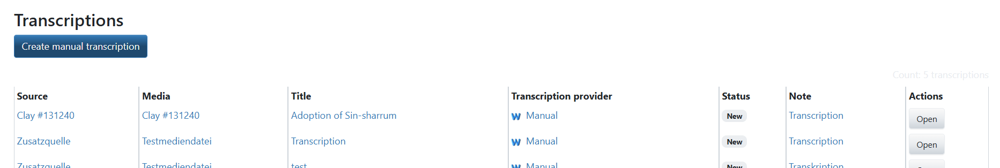
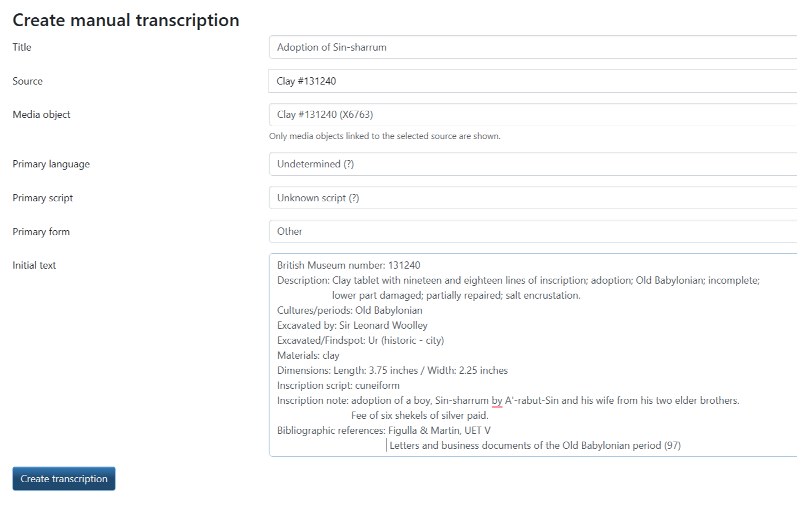
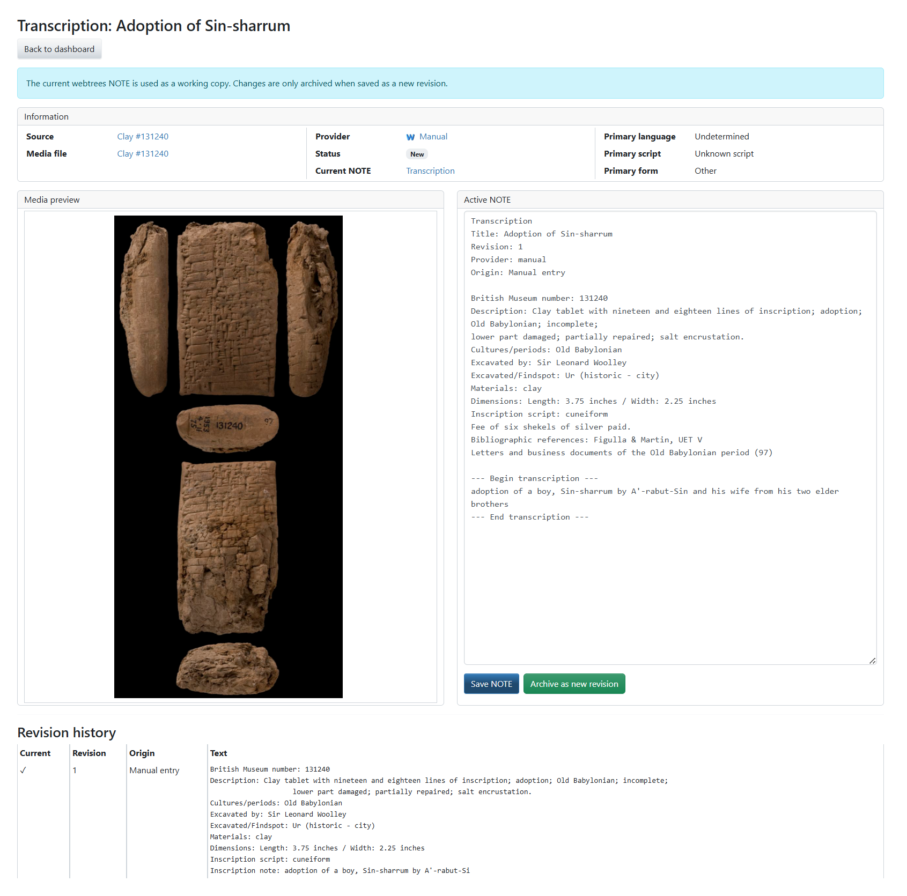
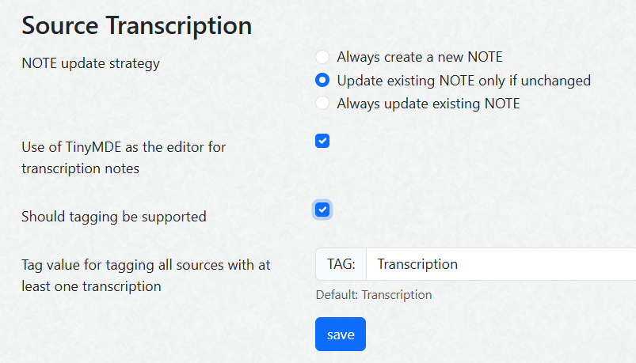

# 🌳 **webtrees** module for Source Transcriptions (hh_source_transcription)

This [webtrees](https://www.webtrees.net) custom module manages transcriptions of sources and source media.

## 📚 Contents

This Readme contains the following main sections

* [Purpose](#Purpose)
* [Scope](#Scope)
* [Main ideas](#Main)
* [Data model](#Data)
* [Database schema](#Database)
* [Design principles](#Design)
* [Workflow](#Workflow)
* [Current status](#Status)
* [Screenshots](#Screenshots) 
* [Literature and links](#Literature)
* [Requirements](#Requirements)
* [Installation](#Installation)
* [Upgrade](#Upgrade)
* [Translation](#Translation)
* [Contact Support](#Support)
* [License](#License)

## 🎯 Purpose

Genealogical sources often contain handwritten or otherwise difficult-to-read texts.  
This module adds a structured workflow for creating, importing, managing, and revising transcriptions in **webtrees**.

External or internal text recognition tools can support the transcription; the module is intentionally provider-agnostic.

Version 1 starts with the manual transcription provider.
The architecture is designed to support additional providers,
like Transkribus, Discourse, and AI tools.

## 🔎 Scope

The module links transcriptions to

- a **source** (`SOUR`)
- usually a specific **media object** (`OBJE`) attached to a source

The media object contains a media file with one or more pages of images (jpg, pdf, tiff, ...),
a single audio or video file (mp3, ...), or a supporting text file (txt, rtf).
If no media object exists or none is selected, the transcription can be attached directly to the source.

The detail page includes a local media viewer. It supports image zoom/pan for common browser image formats via a bundled OpenSeadragon build, native PDF preview, native audio/video playback with a stop button, and clear download links for unsupported or blocked external media.
QuickTime/MOV files use the download fallback because browser support is unreliable.
Local TXT files are displayed as scrollable text. Local RTF files are converted to a simple plain-text preview; complex RTF formatting may still leave visible control text.
Manual media viewer test cases are documented in [docs/media-viewer-test-matrix.md](docs/media-viewer-test-matrix.md).

The control panel consistency check also reviews media files used by transcriptions. It reports suspicious metadata combinations such as missing filename extensions, missing GEDCOM `FORM` values, generic MIME types, or mismatches between filename extension, `FORM`, and MIME type. This is especially relevant before sending files to providers such as Transkribus.

A transcription is not just a note.  
It is treated as a structured object with

- metadata
- a provider
- a status
- a revision history
- a current working shared NOTE in **webtrees**, linked to `OBJE` if a media object is selected, otherwise to `SOUR`

## 💡 Main ideas
The overarching goal is to link a Digital Humanities edition system with a genealogical data model.
The long-term goal is therefore the development of a structured data collection with TEI parsing and integrated GEDCOM generation.
Based on claims webtrees objects such as people, places, and events
should be created or linked.
That could be a first introduction to turn the result-oriented **webtrees** into a process- and evidence-based program.

### 1. Provider-based architecture

The module itself does not assume a single transcription workflow.

Instead, it defines a provider interface.  
Providers can support different workflows, such as

- manual transcription
- crowdsourcing (e.g. discourse.genealogy.net)
- Transkribus import/synchronisation
- file import (TXT, TEI, PAGE XML)
- future OCR/HTR tools
- local AI-based recognition

#### Provider interaction models

Providers are grouped by their interaction model

- Manual/direct: The user creates or edits the transcription directly in webtrees.
- Automated asynchronous: An external or local tool processes an image or document and returns a transcription result. Examples: Transkribus, eScriptorium, OCR/HTR tools, local AI models.
- Crowd-based asynchronous: The module submits a transcription request to a community platform. Human contributors reply, and selected answers can be imported as revisions. Examples: Discourse, specialist reading-help communities.
- Internal collaborative: Other users of the same webtrees installation can submit reading suggestions or revisions.

### 2. Revision history

The actual transcription history is stored in module database tables.

Each revision contains

- origin/provider
- text content
- format
- hash
- timestamp
- optional origin reference (e.g. user, tool version, used transcription model, ...)

This means that revisions remain stable even if the associated webtrees note is edited later.

### 3. webtrees NOTE as working copy

The module can generate or update a shared NOTE linked to the selected transcription target.
This NOTE is the current working version shown and edited in webtrees.
Only that NOTE is exported via GEDCOM.

Important

- the NOTE is **not** the authoritative revision history
- the revision history is stored separately in database tables
- the NOTE may be edited manually by users
- edited notes can optionally be saved as new manual revisions
- NOTE records are created and updated through webtrees record APIs, so CHAN data, pending changes, and reverse links are handled by webtrees
- generated NOTE metadata is also stored in the module revision table

#### Structure of NOTE
The generated NOTE uses a compact Markdown structure with translated labels. It includes the transcription title, source, provider, language/script/form metadata, the selected media object, and a section for each media file when multiple files exist. Revision numbers are not written into the NOTE body.

If the custom modul [linkenhancer](https://codeberg.org/bschwede/linkenhancer) is installed, the advanced editor TinyMDE is used.

### 4. Tagging of transcription targets

Records with at least one transcription can be marked by an additional shared NOTE, such as:

`TAG: Transcription`

The tag NOTE is linked to the selected media object when available. If no media object is selected, it is linked to the source.

This supports genealogical workflow management and filtering.

### 5. Backup and restore

Module backup/restore preserves the transcription revision history stored outside GEDCOM.
It requires the target tree to contain the same GEDCOM records and XREF identifiers.

## 🧩 Data model

### Transcription

A transcription is the main domain object.

Typical properties

- source or optional media object related to a source
- provider (manual, Transkribus, ...)
- title
- type (handwritten Suetterlin, ...)
- language (German, Latin, ...)
- status (in progress, finished, ...)
- current note (text enriched by Markdown)

### Revision

A revision is a specific text state of a transcription.
The revision table also stores the generated NOTE XREF and the user/time information from the most recent NOTE generation or update.

### Note link

The module tracks which NOTE was generated from which revision and whether that NOTE is currently active.

## 🔌 Providers in version 1

### Manual provider

Detailed documentation: [docs/provider/manual.md](docs/provider/manual.md)

The manual provider supports

- creating a new transcription in webtrees
- creating an initial empty revision
- generating a working NOTE
- saving the current NOTE as a new manual revision

### Internal collaboration provider

Detailed documentation: [docs/provider/internal.md](docs/provider/internal.md)

The internal collaboration provider opens an existing transcription for collaborative work by several webtrees users.
It does not create a new transcription and does not ask again for source or media selection.

The initiator starts collaboration from an existing transcription, optionally saving the current working NOTE as a revision first.
The initiator selects team members from users who can access the tree and the transcription target.
Team members can edit the working NOTE and create new revisions.

In the intended workflow

- the initiator opens collaboration and invites collaborators
- all active collaborators are informed when collaboration starts
- all active collaborators are informed about new revisions and status changes
- every active collaborator can set the transcription status to ready for review
- only the initiator can set the transcription status to final
- the initiator or an administrator can reopen a finalized collaboration

The team relation is stored separately from the transcription revision history.
This keeps existing source/media links, the working NOTE, and previous revisions intact.

### Discourse provider
Detailed documentation: [docs/provider/discourse.md](docs/provider/discourse.md)

The Discourse provider uses the Discourse User API Key authorization flow. Users authorize the module from the dashboard; no manual Discourse API key entry is required.

Prepared Discourse attachments are `jpg`, `jpeg`, `png`, `gif`, `webp`, `txt`, and `pdf`. No Discourse file-size limit is currently known in the module.

### Transkribus provider
tbd

Detailed documentation: [docs/provider/transkribus.md](docs/provider/transkribus.md)

The Transkribus provider supports

- creating a transcription associated with a source media object file
- importing transcription text from Transkribus
- creating a new revision from imported text
- updating or generating a current working NOTE

## 🗄 Database schema

The module uses an explicit schema version to allow future migrations. The current schema is documented in [docs/database/schema-3.sql.txt](docs/database/schema-3.sql.txt).

## 🧭 Design principles

- keep the module **provider-agnostic**
- keep revision history separate from editable webtrees notes
- avoid destructive overwrites of manually changed notes
- support both simple and advanced workflows
- make future providers easy to add

## 🛠 Workflow

### Manual
1. Open a source
2. Create a transcription
3. Select provider: Manual
4. Generate a working note
5. Edit the note in webtrees
6. Save the note as a new revision when needed
7. Or select an already existing NOTE containing transcribed text as a new revision

### Internal collaboration
1. Open an existing transcription
2. Open the transcription for internal collaboration
3. Optionally save the current NOTE as a starting revision
4. Select collaborators from eligible webtrees users
5. Notify the selected collaborators
6. Collaborators edit the working NOTE and save new revisions
7. Notify all active collaborators about each new revision
8. Any active collaborator can mark the transcription as ready for review
9. The initiator can mark the transcription as final

### Discourse
1. Open a source with a media object
2. Create a transcription
3. Select provider: Discourse
4. Formulate a reading-help post (what you know; what is your problem?)
5. Upload the media together with meta information in the reading-help forum category at https://discourse.genealogy.net/c/lesehilfe/10
5. Present a link to Discourse for the user
6. Import responses into webtrees after some days
7. Select and edit the responses in webtrees and store them as a revision
8. Update the current working note

### Transkribus
1. Open a source with a media object
2. Create a transcription
3. Select provider: Transkribus
4. Link or upload the media externally
5. Present a link to Transkribus for the user
6. Import a text state into webtrees
7. Store it as a revision
8. Generate or update the current working note

## 🚧 Current status

This project is currently in the design and initial development phase.
It is an early beta version and not ready for production use.

### Current limitations
Permission checks are currently handled in the UI and request handlers. They should be reviewed before production use.

Older development data may still contain NOTE links at the source that are moved to the selected media object only after the affected transcription or tag NOTE is saved again.

External media URLs are embedded directly in the browser only for `http` and `https`. Remote servers can still block previewing through CORS, frame, range-request, or hotlinking policies; in that case the module shows an open-link fallback.

### Implementation of provider candidates by priority

1. Manual and internal collaboration
- must be stable first

2. Discourse
- strategically very interesting for CompGen
- uses existing crowd
- fits with the existing reading-help workflow
- makes webtrees connectable to community knowledge

3. Transkribus
- strong automated specialist

4. File import
- import of PAGE XML, and ALTO XML

5. eScriptorium
- very interesting for self-hosting/open source, but probably more installation and operational effort

6. LLM-/Vision-API (e.g. Kraken HTR, Tesseract)
- Very flexible, but privacy, costs, prompting, and reproducibility must be properly resolved

### Roadmap
The detailed roadmap is maintained in GitHub milestones and issues:

- [Milestones](https://github.com/hartenthaler/hh_source_transcription/milestones)
- [Issues](https://github.com/hartenthaler/hh_source_transcription/issues)

An overview is at [docs/github-roadmap.md](docs/github-roadmap.md)

### Discussion points

Open discussion points are maintained as GitHub issues with the `discussion` label:

- [Discussion issues](https://github.com/hartenthaler/hh_source_transcription/issues?q=is%3Aissue%20label%3Adiscussion)

It is possible to use the GitHub Discussion board:

- [Discussion board](https://github.com/hartenthaler/hh_source_transcription/discussions)

## 🖼 Screenshots

### Dashboard

### Create manual transcription

### Details

### Control panel

## 🔗 Literature and links

- [Zedlitz, Jesper: "Gedbas4all - new data model for genealogy"](https://doi.org/10.5281/zenodo.33958), German original title, COMPUTERGENEALOGIE 4/2009, pp. 15-18, 2009 (checked 23.04.2026).
- [GENTECH Genealogical Data Model](https://xml.coverpages.org/GENTECH-DataModelV11.pdf), 29.05.2000 (checked 23.04.2026).
- [ResearchSpace](https://researchspace.org/argument/) (checked 4.05.2026).
- [CRMinf (CIDOC CRM)](https://cidoc-crm.org/crminf/) (checked 4.05.2026).
- [Transkribus](https://transkribus.org/) (checked 4.05.2026).
- [Transkribus API](https://www.transkribus.org/metagrapho#documentation) (checked 5.05.2026).
- [eScriptorium](https://escriptorium.eu/) (checked 4.05.2026).
- [Wikisource](https://wikisource.org/) (checked 4.05.2026).
- [Discourse](https://discourse.genealogy.net/) (checked 4.05.2026).
- [TEI P5](https://tei-c.org/guidelines/p5/) (checked 4.05.2026).
- [Documentation of the PAGE XML Format for Page Content](https://ocr-d.de/en/gt-guidelines/trans/trPage.html) (checked 4.05.2026).
- [ALTO: Technical Metadata for Layout and Text Objects](https://www.loc.gov/standards/alto/) (checked 4.05.2026).
- [Gramps: Create a Transkribus addon](https://gramps.discourse.group/t/please-create-a-transkribus-addon/8196) (checked 5.05.2026).
- [Gramps: Text recognition](https://gramps.discourse.group/t/text-recognition/9450) (checked 5.05.2026).

## 📌 Requirements

This module requires **webtrees** version 2.2 or later.
The version of PHP must be at least 8.3.
This module has the same requirements as [webtrees#system-requirements](https://github.com/fisharebest/webtrees#system-requirements).

This module was tested with **webtrees** 2.2.6 version
and all available themes and all other custom modules.

## 📥 Installation

Install and use [Custom Module Manager](https://github.com/Jefferson49/CustomModuleManager) for an easy and convenient installation of **webtrees** custom modules.
+ Open the Custom Module Manager view in **webtrees**, scroll to "Source Transcription", and click on the "Install Module" button.

**Manual installation**:

1. Make a database backup.
1. Download the [latest release](https://github.com/hartenthaler/hh_source_transcription/releases/latest).
1. Unzip the package into your `webtrees/modules_v4` directory of your web server.
1. Rename the folder to `hh_source_transcription`.
1. Login to **webtrees** as administrator, go to Control Panel/Modules/Genealogy/Menus, and find the module. It will be called "Source Transcription". Check if it has a tick for "Enabled".
1. Change the order of the menu items to your liking.
1. Finally, click SAVE, to complete the installation.

## ⬆️ Upgrade

To update, replace the `hh_source_transcription` files with the new ones from the latest release.

## 🌍 Translation

You can help to translate this module.
The language information is stored in the folder `resources/lang/`.
You can edit those files and return them to me.
You can do this via a pull request (if you know how) or by e-mail.
Updated translations will be included in the next release of this module.

There are the following translations available
- English by [@Hartenthaler](https://github.com/Hartenthaler)
- German by [@Hartenthaler](https://github.com/Hartenthaler)
- Dutch by [@TheDutchJewel](https://github.com/TheDutchJewel)
- Spanish by Bernat
- Catalan by Bernat

## ❓ Support

- Issues:  You can report errors by raising an issue in this GitHub repository.
- Forum: General webtrees support can be found at the [webtrees forum](https://www.webtrees.net/index.php/forum).

## 📄 License

This module uses GPL-3.0-or-later as a license.

* Copyright (C) 2026 Hermann Hartenthaler
* Derived from **webtrees** - Copyright 2026 webtrees development team.

This program is free software: you can redistribute it and/or modify it
under the terms of the GNU General Public License as published by
the Free Software Foundation, either version 3 of the License, or
(at your option) any later version.

This program is distributed in the hope that it will be useful,
but WITHOUT ANY WARRANTY; without even the implied warranty of
MERCHANTABILITY or FITNESS FOR A PARTICULAR PURPOSE. See the
GNU General Public License for more details.
